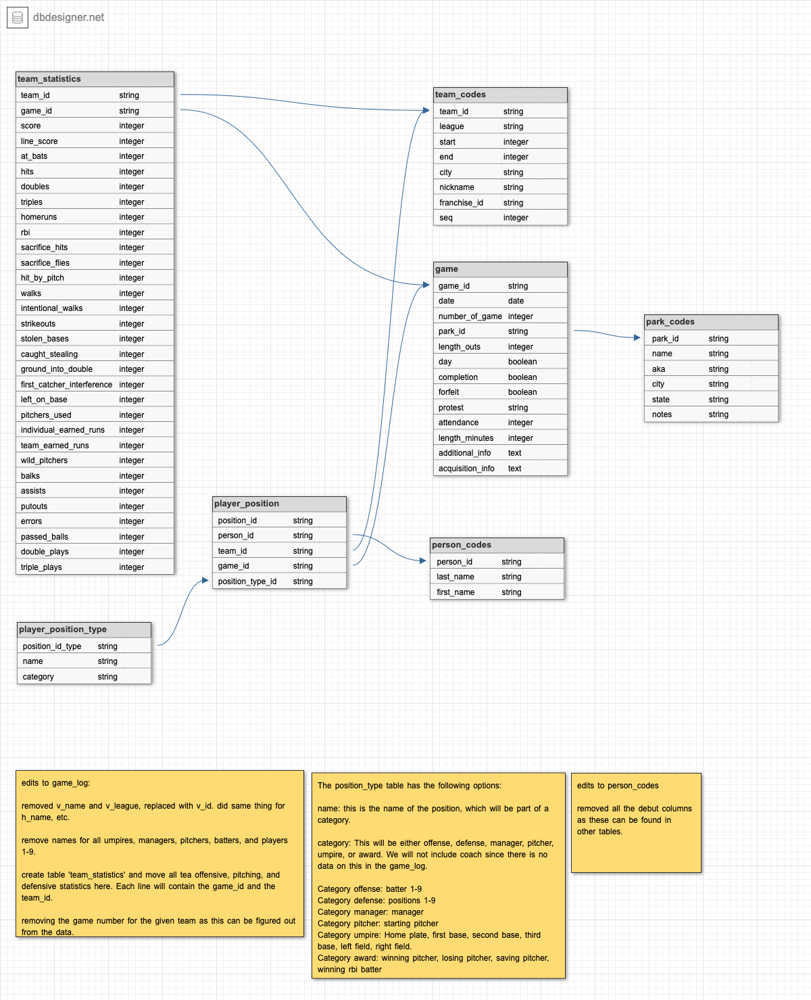

---
title: "Designing and Creating a Database: SQLite"
author: "Chelsea Shoben"
output: github_document
---


*Resources and inspiration:*

https://app.dataquest.io/c/66/m/376/guided-project%3A-designing-and-creating-a-database/1/exploring-the-data  
https://github.com/MuhuriJSON/DesigningAndCreatingDatabase/blob/master/DesigningAndCreatingDatabase.ipynb

<br>
<br>


```{r setup, include=FALSE} 
knitr::opts_chunk$set(warning = FALSE, message = FALSE) 
```


## Outline
###### Exploratory data analysis
###### Import data into SQLite
###### Looking for normalization opportunities
###### Planning a normalized schema
###### Creating normalized database

<br> 
<br>


## Exploratory data analysis
I will perform an EDA to assist in the creation of the normalized database. 
During this process I want to become familiar with the meaning of each column in each file. 
And I will want to think about the relationships between columns both within each file and across different files. 
<br>

###### Setup

Import packages
```{r import-packages, results='hide'}
library(tidyverse)
library(dplyr)
library(RSQLite)
```

Read in data files
```{r, results='hide'}
gameLog <- read_csv("data/game_log.csv")
parkCodes <- read_csv("data/park_codes.csv")
personCodes <- read_csv("data/person_codes.csv")
teamCodes <- read_csv("data/team_codes.csv")
```
<br>
<br>

##### gameLog
The gameLog table contains the following number of rows and columns: `r dim(gameLog)`. 

Let's explore the first 10 rows using `head(gameLog, 10)` to get a feel for the data. 
```{r, eval=FALSE, echo=FALSE}
head(gameLog, 10)
```

Included with these files is a .txt file containing information about the fields in the main file (game_log.csv). 

```{r}
fieldData <- read.delim("data/game_log_fields.txt")
```

<br>
After exploring the gameLog and fieldData files, I have noted that these data give 
basic information about the game including game number, game number, visiting team 
info (name, league, manager, pitchers, batters, offensive stats, pitching stats, 
and defensive stats), same for home team, game information (scoring, location and 
completion) , umpire info, and acquisition info (how complete the data is for that game). 
<br>
<br>


#### Focus questions to answer: 

<br>
**What does each defensive position number represent?**
Each team's starting players has their player ID, name, and defensive position listed in the gameLog. Values 1-9 are used. According to Wikipedia (https://en.wikipedia.org/wiki/Baseball_positions) the 9 positions are designated as follows:

* 1 - pitcher
* 2 - catcher
* 3 - first baseman
* 4 - second baseman
* 5 - third baseman
* 6 - shortstop
* 7 - left fielder
* 8 - center fielder
* 9 - right fielder

<br>


**What are the values in the various league fields, and which leagues do they represent?**
```{r}
unique(gameLog$v_league)
unique(gameLog$h_league)
```
It appears that there are 6 difference leagues referenced by two capital letters in this data set. 
Using Google, I have found the following professional league information. 

* NL - National League (part of MLB)
* AA - American Association (independent, founded in 2005)
* UA - Union Association (used to be MLB, only exists in 1884)
* PL - Players League (independent, only existed 1890?)
* AL - American League (part of MLB)
* FL - Federal League (independent, 1914-1915)
I would like to check these findings against my data. 

Let's check that the date range listed for the AA league matches our data.
```{r}
aaLeague <- 
dplyr::filter(gameLog, v_league == "AA" | h_league == "AA")
min(aaLeague$date)
max(aaLeague$date)
```
Here I used the '|' aka OR operator to select all games where either the visiting team or the home team was in the AA league. 
It looks like the AA league is only listed for games played from 1882 to 1884. 
With more Googling, I found that there have existed two American Association baseball leagues. The American Association of Base Ball Clubs was the one that existed in the 19th century, from 1882 to 1891. This matches up with the min and max date that we see in the filtered tiddle. 

Updates league names:

* NL - National League (part of MLB)
* AA - American Association *of Base Ball Clubs* (independent, 1882-1891)
* UA - Union Association (used to be MLB, only exists in 1884)
* PL - Players League (independent, only existed 1890?)
* AL - American League (part of MLB)
* FL - Federal League (independent, 1914-1915)

I will next check the Union Association
```{r}
uaLeague <- 
dplyr::filter(gameLog, v_league == "UA" | h_league == "UA")
min(uaLeague$date)
max(uaLeague$date)
```
The results match what I would expect. 

Let's check the Players League. 
```{r}
plLeague <- 
  dplyr::filter(gameLog, v_league == "PL" | h_league == "PL")
min(plLeague$date)
max(plLeague$date)
```
Yup, the year 1890 is the only year we see this league in the data set and this lines up with what I Googled. 

Last, is to check the FL league which I believe to be the Federal League. 
```{r}
flLeague <- 
  dplyr::filter(gameLog, v_league == "FL" | h_league == "FL")
min(flLeague$date)
max(flLeague$date)
```
Hooray! This also lines up with my Googling. 
  
<br>


#### Exploring helper files


Let's now explore the additional "helper" files loaded previously. This includes *parkCodes*,
*personCodes*, *teamCodes* files.  

##### parkCodes 
```{r}
dim(parkCodes)
head(parkCodes, 10)
```
The 'parkCodes' file tells us the details for each park, with the unique identifier being the park_id column. This appears to be an exhaustive list, including parks that have closed. The rows appear to be organized alphabetically based on the park_id column. park_id is also a column in the gameLog file. 
<br>

##### personCodes

```{r}
dim(personCodes)
head(personCodes, 10)
```
The personCodes file gives info on the players name and the date of their debut(as either a player, manager, coach, or umpire. There are over 20,000 people codes. 
Cross referencing the gameLog file, the id field in the personCodes file is used in the hp_umpire_id, v_manager_id, h_manager_id,  winning_pitcher_id, losing_pitcher_id, and many more fields on that is *_id giving the person code for different positions in the game. 
<br>

##### teamCodes
Last, let's explore the teamCodes file. 
```{r}
dim(teamCodes)
head(teamCodes, 10)
```
There are 150 teams, each with them team_id, league, start/end, city, any nickname, franch_is, and seq. It looks like the value '0' is used in the 'end' column to indicate a team still exists. The team_id is also a field in the 'gameLog' file. 
At this time, I do not know what 'seq' refers to. Maybe by exploring this column's data more, I can gain insight. 

```{r}
range(teamCodes$seq)
unique(teamCodes$seq)
```
It seems that the minimum is 1 and the maximum value is 4. 

```{r}
table(teamCodes$seq)
```
And the majority of the values are '1'. 
Still not sure what it means but maybe it will make more sense as I move forward through the project. 

<br>


## Importing Data into SQLite


#### Step 1: Designate a primary key

Exploring  the data dictionary available from Retrosheet (the website this data came from), 
we see that they have already designed a key using date, home team, and number of the game. 
After importing our data into SQLite we will construct this unique_id column ourselves using 
these values to match the way Retrosheet refers to unique events. 

https://app.dataquest.io/c/66/m/376/guided-project%3A-designing-and-creating-a-database/2/importing-data-into-sqlite
<br>
<br>

#### Step 2: Create the database
I will be using the package RSQLite to create and modify the database. 
`dbConnect()` establishes a connection to an existing database or creates one if it does not already exist. 
The database name here is "mlb.db"
```{r}
connection <- dbConnect(SQLite(), "mlb.db")
```


```{r drop-existing-tables, include=FALSE}

# Drop all existing tables so code can be re-ran. 

game_log_precaution <- "
  DROP TABLE IF EXISTS game_log;"
dbExecute(connection, game_log_precaution)

person_codes_precaution <- "
  DROP TABLE IF EXISTS person_codes;"
dbExecute(connection, person_codes_precaution)

team_codes_precaution <- "
  DROP TABLE IF EXISTS team_codes;"
dbExecute(connection, team_codes_precaution)

park_codes_precaution <- "
  DROP TABLE IF EXISTS park_codes;"
dbExecute(connection, park_codes_precaution)


```


We want to write the name by referring to the "conn" which is the connection object created above. We will call the table "game_log" and we will use the data from the gameLog object. It will be easier to load the data into a variable and pass that as the value arg for `dbWriteTable()` rather have adding all the data manually. 

```{r}
RSQLite::dbWriteTable(connection, "game_log", gameLog, 
             row.names = FALSE, header = TRUE)

```

Same idea with other data frames. 
```{r}
RSQLite::dbWriteTable(connection, "person_codes", personCodes, 
             row.names = FALSE, header = TRUE)

RSQLite::dbWriteTable(connection, "team_codes", teamCodes, 
             row.names = FALSE, header = TRUE)

RSQLite::dbWriteTable(connection, "park_codes", parkCodes,
             row.names = FALSE, header = TRUE)
```


Let's ensure that all the tables were created. 
```{r}
dbListTables(connection)
```
Success. All four have been made. 
<br>

#### Step 3: Create/add the primary key

Now we will create the new column in *game_log* to hold the unique ID that will refer to each row. This will be a compound key, using data from multiple fields. 

```{r}
alter_game_log_command <- "
  ALTER TABLE game_log
  ADD COLUMN game_id TXT;
"
```

Execute the command created above. 
```{r}
dbExecute(connection, alter_game_log_command)
```

Next, we will use string concatenation to update this new column. 

```{r}
update_game_log_command <- "
  UPDATE game_log
  SET game_id = date || h_name || number_of_game
  WHERE game_id IS NULL;
"
```

Execute the command:
```{r}
dbExecute(connection, update_game_log_command)
```


```{r}
check_query_1 <- "
  SELECT
    game_id, 
    date,
    h_name, 
    number_of_game
  FROM game_log
  LIMIT 5;
"
```

We will capture this result in a new variable
```{r}
check <- dbGetQuery(connection, check_query_1)
head(check)
```
This quick check helps us visualize the success of adding the new primary key to the table. 
<br>
<br>

## Looking for normalization opportunities 

A first step to normalizing is removing redundant data. For example, the player names column in the game_log table such as 'v_player_1_name', etc. can be derived by cross referencing the player id to the person_codes table. The names should be removed from the game_log table as this is redundant data. 

```{r}
gameLog$v_player_1_name[1]
personCodes %>% filter_all(any_vars(. %in% c("Deacon")))
```
It's also important to note that the player id is more informative since there are players with the same first and last name in the data. 

```{r chunk-help-me-visualize-tables, echo=FALSE, results='hide'}
head (gameLog)
head (parkCodes)
head (personCodes)
head (teamCodes)
```

For game_log:       Each game lists info for 9 players from each team. This data can be represented by a separate table, which each player and their appearances tracked. 
For park_codes:     The 'start' and 'end' dates can be derived from the game_log table. 
For person_codes:     The 'player_debut', 'mgr_debut', and 'coach_debut' can be derived from data in the game_log table.
For team_codes:     The 'start' and 'end' data for each team can be derived from the game_log table. 
<br>

## Planning a normalized schema


I used dbdesigner.net to create the database schema. 


<br>

## Creating normalized database


### Begin with tables with no foreign keys
<br>
**1) Alter the person_codes table to only have person_id, first_name, and last_name.**

```{r}
dbListTables(connection)
dbListFields(connection, "person_codes")
```

```{r, results='hide'}
drop_player_debut <- "
  ALTER TABLE person_codes
  DROP COLUMN player_debut;"
drop_mgr_debut <- "
  ALTER TABLE person_codes
  DROP COLUMN mgr_debut;"
drop_coach_debut <- "
  ALTER TABLE person_codes
  DROP COLUMN coach_debut;"
drop_ump_debut <- "
  ALTER TABLE person_codes
  DROP COLUMN ump_debut;"

dbExecute(connection, drop_player_debut)
dbExecute(connection, drop_mgr_debut)
dbExecute(connection, drop_coach_debut)
dbExecute(connection, drop_ump_debut)
```

Let's see which columns are left. 
```{r}
dbListFields(connection, "person_codes")
```
Great. The last thing is to change these remaining column names into "person_id", "last_name", and "first_name".  


```{r, results='hide'}
rename_id_person_codes <- "
  ALTER TABLE person_codes
  RENAME COLUMN id to person_id;"
rename_last_person_codes <- "
  ALTER TABLE person_codes
  RENAME COLUMN last to last_name;"
rename_first_person_codes <- "
  ALTER TABLE person_codes
  RENAME COLUMN first to first_name;"

dbExecute(connection, rename_id_person_codes)
dbExecute(connection, rename_last_person_codes)
dbExecute(connection, rename_first_person_codes)
dbListFields(connection, "person_codes")

```

<br>

**2) Edit park_codes to reflect changes above. We want to remove redundant data.**

Let's look at the columns currently in this table. 
```{r}
dbListFields(connection, "park_codes")
```

We will remove 'start', 'end', and 'league' as these information will be available in the game_log table.
```{r, results='hide'}
drop_start_park <- "
  ALTER TABLE park_codes
  DROP COLUMN start;"
drop_end_park <- "
  ALTER TABLE park_codes
  DROP COLUMN end;"
drop_league_park <- "
  ALTER TABLE park_codes
  DROP COLUMN league;"

dbExecute(connection, drop_start_park)
dbExecute(connection, drop_end_park)
dbExecute(connection, drop_league_park)
dbListFields(connection, "park_codes")
```

<br>


**3) Create the new "player_position_type" table. ** 

I will import a .csv file containing all the information for this table.


```{r, include=FALSE}
# Code to drop the table if it exists, we will recreate it in the proceeding code
player_position_precaution <- "
  DROP TABLE IF EXISTS player_position_type;"
dbExecute(connection, player_position_precaution)
```


csv import:
```{r}
playerPositionType = read_csv("data/appearance_type.csv")
```
Use the csv to create the new table
```{r}
dbWriteTable(conn = connection, name = "player_position_type", 
             value = playerPositionType, 
             row.names = FALSE, header = TRUE)
```
```{r}
check_player_pos <- "
  SELECT *
  FROM player_position_type;"
check <- dbGetQuery(connection, check_player_pos)
head(check)
```
<br>


### Add Game and Team tables


It will be easiest to create a new game_log table and import the selected columns versus deleting columns. 
This new table will be called "game".
Foreign keys can be set at this time. 

```{r, include=FALSE}
## drop tables if they already exist
game_table_precaution <- "
  DROP TABLE IF EXISTS game;"
dbExecute(connection, game_table_precaution)
```


```{r}
create_game_table_query <- "
  CREATE TABLE IF NOT EXISTS game (
    game_id TEXT PRIMARY KEY, 
    date TEXT, 
    number_of_game INTEGER, 
    park_id TEXT,
    length_outs INTEGER, 
    day TEXT, 
    completion TEXT, 
    forfeit TEXT, 
    protest TEXT,
    attendance INTEGER, 
    length_minutes INTEGER, 
    additional_info TEXT, 
    acquisition_info TEXT,
    FOREIGN KEY (park_id) REFERENCES park_codes(park_id)
  );
" 
dbExecute(connection, create_game_table_query)
```

```{r}
# Use single quotes to handle the double quotes in the switch case for day_night

insert_to_game_query <- '
  INSERT OR IGNORE INTO game
  SELECT
    game_id,
    date,
    number_of_game,
    park_id,
    length_outs, 
    CASE
      WHEN day_night = "D" THEN 1
      WHEN day_night = "N" then 0
      ELSE NULL
      END
      AS day,
    completion, 
    forfeit, 
    protest, 
    attendance,
    length_minutes,
    additional_info,
    acquisition_info
  FROM game_log;
'

dbExecute(connection, insert_to_game_query)
dbListFields(connection, "game")
```
