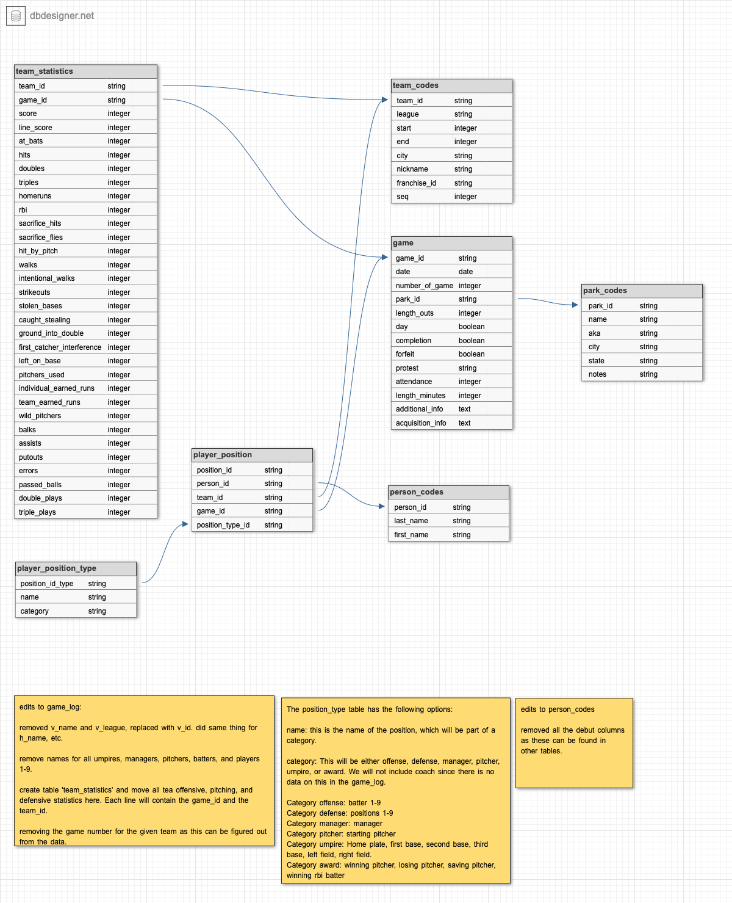

Designing and Creating a Database: SQLite
================
Chelsea Shoben

*Resources and inspiration:*

<https://app.dataquest.io/c/66/m/376/guided-project%3A-designing-and-creating-a-database/1/exploring-the-data>  
<https://github.com/MuhuriJSON/DesigningAndCreatingDatabase/blob/master/DesigningAndCreatingDatabase.ipynb>

<br> <br>

## Exploratory Data Analysis

I will perform an EDA to assist in the creation of the normalized
database. During this process I want to become familiar with the meaning
of each column in each file. And I will want to think about the
relationships between columns both within each file and across different
files. <br>

###### Setup

Import packages

``` r
library(tidyverse)
library(dplyr)
library(RSQLite)
```

Read in data files

``` r
gameLog <- read_csv("data/game_log.csv")
parkCodes <- read_csv("data/park_codes.csv")
personCodes <- read_csv("data/person_codes.csv")
teamCodes <- read_csv("data/team_codes.csv")
```

<br> <br>

##### gameLog

The gameLog table contains the following number of rows and columns:
171907, 161.

Let’s explore the first 10 rows using `head(gameLog, 10)` to get a feel
for the data.

Included with these files is a .txt file containing information about
the fields in the main file (game_log.csv).

``` r
fieldData <- read.delim("data/game_log_fields.txt")
```

<br> After exploring the gameLog and fieldData files, I have noted that
these data give basic information about the game including game number,
game number, visiting team info (name, league, manager, pitchers,
batters, offensive stats, pitching stats, and defensive stats), same for
home team, game information (scoring, location and completion) , umpire
info, and acquisition info (how complete the data is for that game).
<br> <br>

#### Focus questions to answer:

<br> **What does each defensive position number represent?** Each team’s
starting players has their player ID, name, and defensive position
listed in the gameLog. Values 1-9 are used. According to Wikipedia
(<https://en.wikipedia.org/wiki/Baseball_positions>) the 9 positions are
designated as follows:

- 1 - pitcher
- 2 - catcher
- 3 - first baseman
- 4 - second baseman
- 5 - third baseman
- 6 - shortstop
- 7 - left fielder
- 8 - center fielder
- 9 - right fielder

<br>

**What are the values in the various league fields, and which leagues do
they represent?**

``` r
unique(gameLog$v_league)
```

    ## [1] NA   "NL" "AA" "UA" "PL" "AL" "FL"

``` r
unique(gameLog$h_league)
```

    ## [1] NA   "NL" "AA" "UA" "PL" "AL" "FL"

It appears that there are 6 difference leagues referenced by two capital
letters in this data set. Using Google, I have found the following
professional league information.

- NL - National League (part of MLB)
- AA - American Association (independent, founded in 2005)
- UA - Union Association (used to be MLB, only exists in 1884)
- PL - Players League (independent, only existed 1890?)
- AL - American League (part of MLB)
- FL - Federal League (independent, 1914-1915) I would like to check
  these findings against my data.

Let’s check that the date range listed for the AA league matches our
data.

``` r
aaLeague <- 
dplyr::filter(gameLog, v_league == "AA" | h_league == "AA")
min(aaLeague$date)
```

    ## [1] 18820502

``` r
max(aaLeague$date)
```

    ## [1] 18911006

Here I used the ‘\|’ aka OR operator to select all games where either
the visiting team or the home team was in the AA league. It looks like
the AA league is only listed for games played from 1882 to 1884. With
more Googling, I found that there have existed two American Association
baseball leagues. The American Association of Base Ball Clubs was the
one that existed in the 19th century, from 1882 to 1891. This matches up
with the min and max date that we see in the filtered tiddle.

Updates league names:

- NL - National League (part of MLB)
- AA - American Association *of Base Ball Clubs* (independent,
  1882-1891)
- UA - Union Association (used to be MLB, only exists in 1884)
- PL - Players League (independent, only existed 1890?)
- AL - American League (part of MLB)
- FL - Federal League (independent, 1914-1915)

I will next check the Union Association

``` r
uaLeague <- 
dplyr::filter(gameLog, v_league == "UA" | h_league == "UA")
min(uaLeague$date)
```

    ## [1] 18840417

``` r
max(uaLeague$date)
```

    ## [1] 18841019

The results match what I would expect.

Let’s check the Players League.

``` r
plLeague <- 
  dplyr::filter(gameLog, v_league == "PL" | h_league == "PL")
min(plLeague$date)
```

    ## [1] 18900419

``` r
max(plLeague$date)
```

    ## [1] 18901004

Yup, the year 1890 is the only year we see this league in the data set
and this lines up with what I Googled.

Last, is to check the FL league which I believe to be the Federal
League.

``` r
flLeague <- 
  dplyr::filter(gameLog, v_league == "FL" | h_league == "FL")
min(flLeague$date)
```

    ## [1] 19140413

``` r
max(flLeague$date)
```

    ## [1] 19151003

Hooray! This also lines up with my Googling.

<br>

#### Exploring helper files

Let’s now explore the additional “helper” files loaded previously. This
includes *parkCodes*, *personCodes*, *teamCodes* files.

##### parkCodes

``` r
dim(parkCodes)
```

    ## [1] 252   9

``` r
head(parkCodes, 10)
```

    ## # A tibble: 10 × 9
    ##    park_id name                       aka   city  state start end   league notes
    ##    <chr>   <chr>                      <chr> <chr> <chr> <chr> <chr> <chr>  <chr>
    ##  1 ALB01   Riverside Park             <NA>  Alba… NY    09/1… 05/3… NL     TRN:…
    ##  2 ALT01   Columbia Park              <NA>  Alto… PA    04/3… 05/3… UA     <NA> 
    ##  3 ANA01   Angel Stadium of Anaheim   Edis… Anah… CA    04/1… <NA>  AL     <NA> 
    ##  4 ARL01   Arlington Stadium          <NA>  Arli… TX    04/2… 10/0… AL     <NA> 
    ##  5 ARL02   Rangers Ballpark in Arlin… The … Arli… TX    04/1… <NA>  AL     <NA> 
    ##  6 ATL01   Atlanta-Fulton County Sta… <NA>  Atla… GA    04/1… 09/2… NL     <NA> 
    ##  7 ATL02   Turner Field               <NA>  Atla… GA    04/0… 10/0… NL     <NA> 
    ##  8 ATL03   Suntrust Park              <NA>  Atla… GA    04/1… <NA>  NL     <NA> 
    ##  9 BAL01   Madison Avenue Grounds     <NA>  Balt… MD    07/0… 07/0… <NA>   WS3  
    ## 10 BAL02   Newington Park             <NA>  Balt… MD    04/2… 09/3… <NA>   BL1:…

The ‘parkCodes’ file tells us the details for each park, with the unique
identifier being the park_id column. This appears to be an exhaustive
list, including parks that have closed. The rows appear to be organized
alphabetically based on the park_id column. park_id is also a column in
the gameLog file. <br>

##### personCodes

``` r
dim(personCodes)
```

    ## [1] 20494     7

``` r
head(personCodes, 10)
```

    ## # A tibble: 10 × 7
    ##    id       last        first    player_debut mgr_debut coach_debut ump_debut 
    ##    <chr>    <chr>       <chr>    <chr>        <chr>     <chr>       <chr>     
    ##  1 aardd001 Aardsma     David    04/06/2004   <NA>      <NA>        <NA>      
    ##  2 aaroh101 Aaron       Hank     04/13/1954   <NA>      <NA>        <NA>      
    ##  3 aarot101 Aaron       Tommie   04/10/1962   <NA>      04/06/1979  <NA>      
    ##  4 aased001 Aase        Don      07/26/1977   <NA>      <NA>        <NA>      
    ##  5 abada001 Abad        Andy     09/10/2001   <NA>      <NA>        <NA>      
    ##  6 abadf001 Abad        Fernando 07/28/2010   <NA>      <NA>        <NA>      
    ##  7 abadj101 Abadie      John     04/26/1875   <NA>      <NA>        <NA>      
    ##  8 abbae101 Abbaticchio Ed       09/04/1897   <NA>      <NA>        <NA>      
    ##  9 abbeb101 Abbey       Bert     06/14/1892   <NA>      <NA>        <NA>      
    ## 10 abbec101 Abbey       Charlie  08/16/1893   <NA>      <NA>        07/21/1897

The personCodes file gives info on the players name and the date of
their debut(as either a player, manager, coach, or umpire. There are
over 20,000 people codes. Cross referencing the gameLog file, the id
field in the personCodes file is used in the hp_umpire_id, v_manager_id,
h_manager_id, winning_pitcher_id, losing_pitcher_id, and many more
fields on that is \*\_id giving the person code for different positions
in the game. <br>

##### teamCodes

Last, let’s explore the teamCodes file.

``` r
dim(teamCodes)
```

    ## [1] 150   8

``` r
head(teamCodes, 10)
```

    ## # A tibble: 10 × 8
    ##    team_id league start   end city      nickname        franch_id   seq
    ##    <chr>   <chr>  <dbl> <dbl> <chr>     <chr>           <chr>     <dbl>
    ##  1 ALT     UA      1884  1884 Altoona   Mountain Cities ALT           1
    ##  2 ARI     NL      1998     0 Arizona   Diamondbacks    ARI           1
    ##  3 BFN     NL      1879  1885 Buffalo   Bisons          BFN           1
    ##  4 BFP     PL      1890  1890 Buffalo   Bisons          BFP           1
    ##  5 BL1     <NA>    1872  1874 Baltimore Canaries        BL1           1
    ##  6 BL2     AA      1882  1891 Baltimore Orioles         BL2           1
    ##  7 BLN     NL      1892  1899 Baltimore Orioles         BL2           2
    ##  8 BL4     <NA>    1873  1873 Baltimore Marylands       BL4           1
    ##  9 BLA     AL      1901  1902 Baltimore Orioles         BLA           1
    ## 10 NYA     AL      1903     0 New York  Yankees         BLA           2

There are 150 teams, each with them team_id, league, start/end, city,
any nickname, franch_is, and seq. It looks like the value ‘0’ is used in
the ‘end’ column to indicate a team still exists. The team_id is also a
field in the ‘gameLog’ file. At this time, I do not know what ‘seq’
refers to. Maybe by exploring this column’s data more, I can gain
insight.

``` r
range(teamCodes$seq)
```

    ## [1] 1 4

``` r
unique(teamCodes$seq)
```

    ## [1] 1 2 3 4

It seems that the minimum is 1 and the maximum value is 4.

``` r
table(teamCodes$seq)
```

    ## 
    ##   1   2   3   4 
    ## 115  27   7   1

And the majority of the values are ‘1’. Still not sure what it means but
maybe it will make more sense as I move forward through the project.

<br>

## Importing Data into SQLite

#### Step 1: Designate a primary key

Exploring the data dictionary available from Retrosheet (the website
this data came from), we see that they have already designed a key using
date, home team, and number of the game. After importing our data into
SQLite we will construct this unique_id column ourselves using these
values to match the way Retrosheet refers to unique events.

<https://app.dataquest.io/c/66/m/376/guided-project%3A-designing-and-creating-a-database/2/importing-data-into-sqlite>
<br>

#### Step 2: Create the database

I will be using the package RSQLite to create and modify the database.
`dbConnect()` establishes a connection to an existing database or
creates one if it does not already exist. The database name here is
“mlb.db”

``` r
connection <- dbConnect(SQLite(), "mlb.db")
```

We want to write the name by referring to the “conn” which is the
connection object created above. We will call the table “game_log” and
we will use the data from the gameLog object. It will be easier to load
the data into a variable and pass that as the value arg for
`dbWriteTable()` rather have adding all the data manually.

``` r
RSQLite::dbWriteTable(connection, "game_log", gameLog, 
             row.names = FALSE, header = TRUE)
```

Same idea with other data frames.

``` r
RSQLite::dbWriteTable(connection, "person_codes", personCodes, 
             row.names = FALSE, header = TRUE)

RSQLite::dbWriteTable(connection, "team_codes", teamCodes, 
             row.names = FALSE, header = TRUE)

RSQLite::dbWriteTable(connection, "park_codes", parkCodes,
             row.names = FALSE, header = TRUE)
```

Let’s ensure that all the tables were created.

``` r
dbListTables(connection)
```

    ## [1] "game"                 "game_log"             "park_codes"          
    ## [4] "person_codes"         "player_position_type" "team_codes"

Success. All four have been made. <br>

#### Step 3: Create/add the primary key

Now we will create the new column in *game_log* to hold the unique ID
that will refer to each row. This will be a compound key, using data
from multiple fields.

``` r
alter_game_log_command <- "
  ALTER TABLE game_log
  ADD COLUMN game_id TXT;
"
```

Let’s execute the command created above.

``` r
dbExecute(connection, alter_game_log_command)
```

    ## [1] 0

Next, I will use string concatenation to update this new column.

``` r
update_game_log_command <- "
  UPDATE game_log
  SET game_id = date || h_name || number_of_game
  WHERE game_id IS NULL;
"
```

Execute the command:

``` r
dbExecute(connection, update_game_log_command)
```

    ## [1] 171907

``` r
check_query_1 <- "
  SELECT
    game_id, 
    date,
    h_name, 
    number_of_game
  FROM game_log
  LIMIT 5;
"
```

We will capture this result in a new variable

``` r
check <- dbGetQuery(connection, check_query_1)
head(check)
```

    ##            game_id     date h_name number_of_game
    ## 1 18710504.0FW10.0 18710504    FW1              0
    ## 2 18710505.0WS30.0 18710505    WS3              0
    ## 3 18710506.0RC10.0 18710506    RC1              0
    ## 4 18710508.0CH10.0 18710508    CH1              0
    ## 5 18710509.0TRO0.0 18710509    TRO              0

<br>

## Looking for Normalization Opportunities

\*\* A first step to normalizing is removing redundant data. For
example, the player names column in the game_log table such as
‘v_player_1\_name’, etc. can be derived by cross referencing the player
id to the person_codes table. The names should be removed from the
game_log table as this is redundant data.

``` r
head(gameLog)
```

    ## # A tibble: 6 × 161
    ##       date number_of_game day_of_week v_name v_league v_game_number h_name
    ##      <dbl>          <dbl> <chr>       <chr>  <chr>            <dbl> <chr> 
    ## 1 18710504              0 Thu         CL1    <NA>                 1 FW1   
    ## 2 18710505              0 Fri         BS1    <NA>                 1 WS3   
    ## 3 18710506              0 Sat         CL1    <NA>                 2 RC1   
    ## 4 18710508              0 Mon         CL1    <NA>                 3 CH1   
    ## 5 18710509              0 Tue         BS1    <NA>                 2 TRO   
    ## 6 18710511              0 Thu         CH1    <NA>                 2 CL1   
    ## # … with 154 more variables: h_league <chr>, h_game_number <dbl>,
    ## #   v_score <dbl>, h_score <dbl>, length_outs <dbl>, day_night <chr>,
    ## #   completion <lgl>, forfeit <lgl>, protest <chr>, park_id <chr>,
    ## #   attendance <dbl>, length_minutes <dbl>, v_line_score <chr>,
    ## #   h_line_score <chr>, v_at_bats <dbl>, v_hits <dbl>, v_doubles <dbl>,
    ## #   v_triples <dbl>, v_homeruns <dbl>, v_rbi <dbl>, v_sacrifice_hits <dbl>,
    ## #   v_sacrifice_flies <dbl>, v_hit_by_pitch <dbl>, v_walks <dbl>, …

``` r
head (parkCodes)
```

    ## # A tibble: 6 × 9
    ##   park_id name                        aka   city  state start end   league notes
    ##   <chr>   <chr>                       <chr> <chr> <chr> <chr> <chr> <chr>  <chr>
    ## 1 ALB01   Riverside Park              <NA>  Alba… NY    09/1… 05/3… NL     TRN:…
    ## 2 ALT01   Columbia Park               <NA>  Alto… PA    04/3… 05/3… UA     <NA> 
    ## 3 ANA01   Angel Stadium of Anaheim    Edis… Anah… CA    04/1… <NA>  AL     <NA> 
    ## 4 ARL01   Arlington Stadium           <NA>  Arli… TX    04/2… 10/0… AL     <NA> 
    ## 5 ARL02   Rangers Ballpark in Arling… The … Arli… TX    04/1… <NA>  AL     <NA> 
    ## 6 ATL01   Atlanta-Fulton County Stad… <NA>  Atla… GA    04/1… 09/2… NL     <NA>

``` r
head (personCodes)
```

    ## # A tibble: 6 × 7
    ##   id       last    first    player_debut mgr_debut coach_debut ump_debut
    ##   <chr>    <chr>   <chr>    <chr>        <chr>     <chr>       <chr>    
    ## 1 aardd001 Aardsma David    04/06/2004   <NA>      <NA>        <NA>     
    ## 2 aaroh101 Aaron   Hank     04/13/1954   <NA>      <NA>        <NA>     
    ## 3 aarot101 Aaron   Tommie   04/10/1962   <NA>      04/06/1979  <NA>     
    ## 4 aased001 Aase    Don      07/26/1977   <NA>      <NA>        <NA>     
    ## 5 abada001 Abad    Andy     09/10/2001   <NA>      <NA>        <NA>     
    ## 6 abadf001 Abad    Fernando 07/28/2010   <NA>      <NA>        <NA>

``` r
head (teamCodes)
```

    ## # A tibble: 6 × 8
    ##   team_id league start   end city      nickname        franch_id   seq
    ##   <chr>   <chr>  <dbl> <dbl> <chr>     <chr>           <chr>     <dbl>
    ## 1 ALT     UA      1884  1884 Altoona   Mountain Cities ALT           1
    ## 2 ARI     NL      1998     0 Arizona   Diamondbacks    ARI           1
    ## 3 BFN     NL      1879  1885 Buffalo   Bisons          BFN           1
    ## 4 BFP     PL      1890  1890 Buffalo   Bisons          BFP           1
    ## 5 BL1     <NA>    1872  1874 Baltimore Canaries        BL1           1
    ## 6 BL2     AA      1882  1891 Baltimore Orioles         BL2           1

For game_log: \* Each game lists info for 9 players from each team. This
data can be represented by a separate table, which each player and their
appearances tracked. For park_codes: \* The ‘start’ and ‘end’ dates can
be derived from the game_log table. For person_codes: \* The
‘player_debut’, ‘mgr_debut’, and ‘coach_debut’ can be derived from data
in the game_log table. For team_codes \* The ‘start’ and ‘end’ data for
each team can be derived from the game_log table.

## Planning a Normalized Schema

I am using dbdesigner.net to create my database schema.

## Creating the normalized database



### Begin with tables with no foreign keys

*1) Alter the person_codes table to only have person_id, first_name, and
last_name.*

``` r
dbListTables(connection)
```

    ## [1] "game"                 "game_log"             "park_codes"          
    ## [4] "person_codes"         "player_position_type" "team_codes"

``` r
dbListFields(connection, "person_codes")
```

    ## [1] "id"           "last"         "first"        "player_debut" "mgr_debut"   
    ## [6] "coach_debut"  "ump_debut"

``` r
drop_player_debut <- "
  ALTER TABLE person_codes
  DROP COLUMN player_debut;"
drop_mgr_debut <- "
  ALTER TABLE person_codes
  DROP COLUMN mgr_debut;"
drop_coach_debut <- "
  ALTER TABLE person_codes
  DROP COLUMN coach_debut;"
drop_ump_debut <- "
  ALTER TABLE person_codes
  DROP COLUMN ump_debut;"

dbExecute(connection, drop_player_debut)
```

    ## [1] 0

``` r
dbExecute(connection, drop_mgr_debut)
```

    ## [1] 0

``` r
dbExecute(connection, drop_coach_debut)
```

    ## [1] 0

``` r
dbExecute(connection, drop_ump_debut)
```

    ## [1] 0

``` r
dbListFields(connection, "person_codes")
```

    ## [1] "id"    "last"  "first"

The last thing to change the remaining column names into “person_id”,
“last_name”, and “first_name”.

``` r
rename_id_person_codes <- "
  ALTER TABLE person_codes
  RENAME COLUMN id to person_id;"
rename_last_person_codes <- "
  ALTER TABLE person_codes
  RENAME COLUMN last to last_name;"
rename_first_person_codes <- "
  ALTER TABLE person_codes
  RENAME COLUMN first to first_name;"

dbExecute(connection, rename_id_person_codes)
```

    ## [1] 0

``` r
dbExecute(connection, rename_last_person_codes)
```

    ## [1] 0

``` r
dbExecute(connection, rename_first_person_codes)
```

    ## [1] 0

``` r
dbListFields(connection, "person_codes")
```

    ## [1] "person_id"  "last_name"  "first_name"

*2) Edit park_codes to reflect changes above. We want to remove
redundant data.* - remove ‘start’, ‘end’, and ‘league’ as this
information will be available in the game_log table.

``` r
dbListFields(connection, "park_codes")
```

    ## [1] "park_id" "name"    "aka"     "city"    "state"   "start"   "end"    
    ## [8] "league"  "notes"

``` r
drop_start_park <- "
  ALTER TABLE park_codes
  DROP COLUMN start;"
drop_end_park <- "
  ALTER TABLE park_codes
  DROP COLUMN end;"
drop_league_park <- "
  ALTER TABLE park_codes
  DROP COLUMN league;"

dbExecute(connection, drop_start_park)
```

    ## [1] 0

``` r
dbExecute(connection, drop_end_park)
```

    ## [1] 0

``` r
dbExecute(connection, drop_league_park)
```

    ## [1] 0

``` r
dbListFields(connection, "park_codes")
```

    ## [1] "park_id" "name"    "aka"     "city"    "state"   "notes"

*3) Create the new “player_position_type” table. I will import a .csv
file containing all the information for this table.*

Code to drop the table if it exists, we will recreate it in the
proceeding code

``` r
player_position_precaution <- "
  DROP TABLE IF EXISTS player_position_type;"
dbExecute(connection, player_position_precaution)
```

    ## [1] 0

csv import:

``` r
playerPositionType = read_csv("data/appearance_type.csv")
```

Use the csv to create the new table

``` r
dbWriteTable(conn = connection, name = "player_position_type", 
             value = playerPositionType, 
             row.names = FALSE, header = TRUE)
```

``` r
check_player_pos <- "
  SELECT *
  FROM player_position_type;"
check <- dbGetQuery(connection, check_player_pos)
head(check)
```

    ##   appearance_type_id     name category
    ## 1                 O1 Batter 1  offense
    ## 2                 O2 Batter 2  offense
    ## 3                 O3 Batter 3  offense
    ## 4                 O4 Batter 4  offense
    ## 5                 O5 Batter 5  offense
    ## 6                 O6 Batter 6  offense

### Add Game and Team tables

It will be easiest to create a new game_log table and import the
selected columns versus deleting columns. This new table will be called
“game”. Foreign keys can be set at this time.

``` r
game_table_precaution <- "
  DROP TABLE IF EXISTS game;"
dbExecute(connection, game_table_precaution)
```

    ## [1] 0

``` r
create_game_table_query <- "
  CREATE TABLE IF NOT EXISTS game (
    game_id TEXT PRIMARY KEY, 
    date TEXT, 
    number_of_game INTEGER, 
    park_id TEXT,
    length_outs INTEGER, 
    day TEXT, 
    completion TEXT, 
    forfeit TEXT, 
    protest TEXT,
    attendance INTEGER, 
    length_minutes INTEGER, 
    additional_info TEXT, 
    acquisition_info TEXT,
    FOREIGN KEY (park_id) REFERENCES park_codes(park_id)
  );
" 
dbExecute(connection, create_game_table_query)
```

    ## [1] 0

``` r
# Use single quotes to handle the double quotes in the switch case for day_night

insert_to_game_query <- '
  INSERT OR IGNORE INTO game
  SELECT
    game_id,
    date,
    number_of_game,
    park_id,
    length_outs, 
    CASE
      WHEN day_night = "D" THEN 1
      WHEN day_night = "N" then 0
      ELSE NULL
      END
      AS day,
    completion, 
    forfeit, 
    protest, 
    attendance,
    length_minutes,
    additional_info,
    acquisition_info
  FROM game_log;
'

dbExecute(connection, insert_to_game_query)
```

    ## [1] 171907

``` r
dbListFields(connection, "game")
```

    ##  [1] "game_id"          "date"             "number_of_game"   "park_id"         
    ##  [5] "length_outs"      "day"              "completion"       "forfeit"         
    ##  [9] "protest"          "attendance"       "length_minutes"   "additional_info" 
    ## [13] "acquisition_info"
